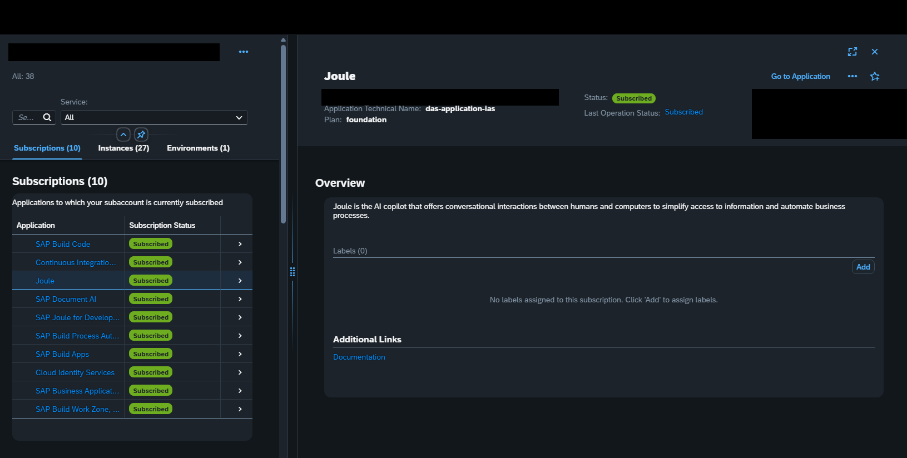
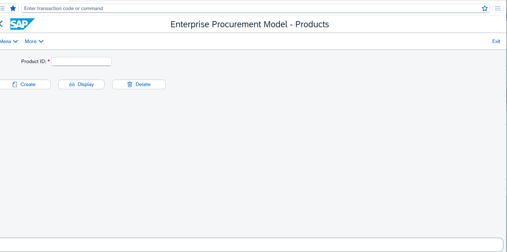
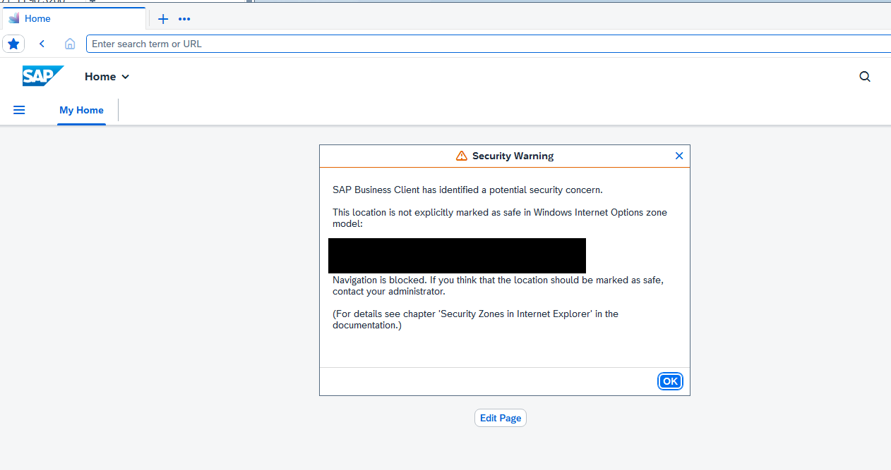
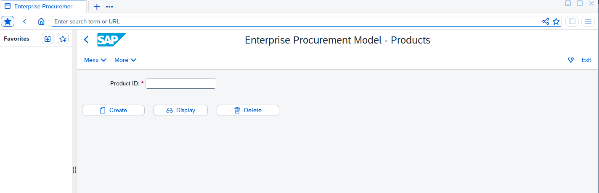
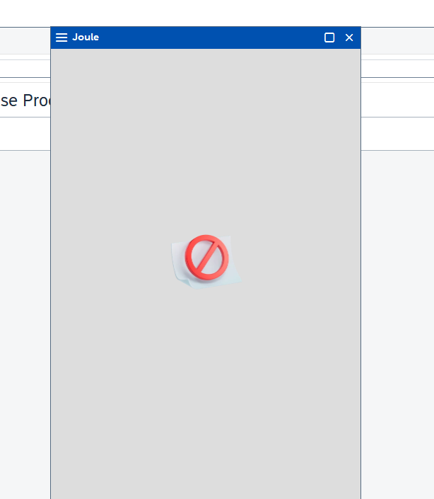
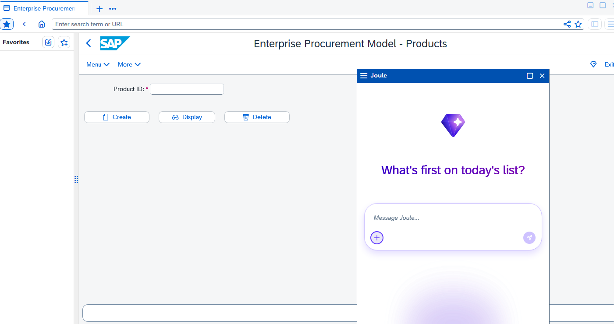
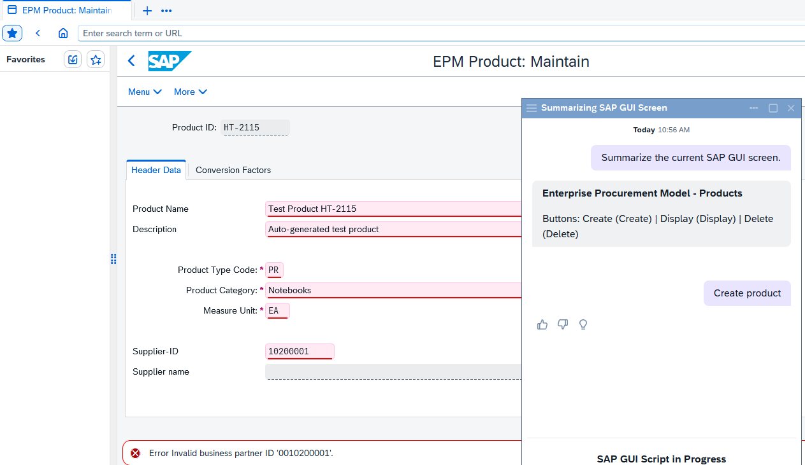
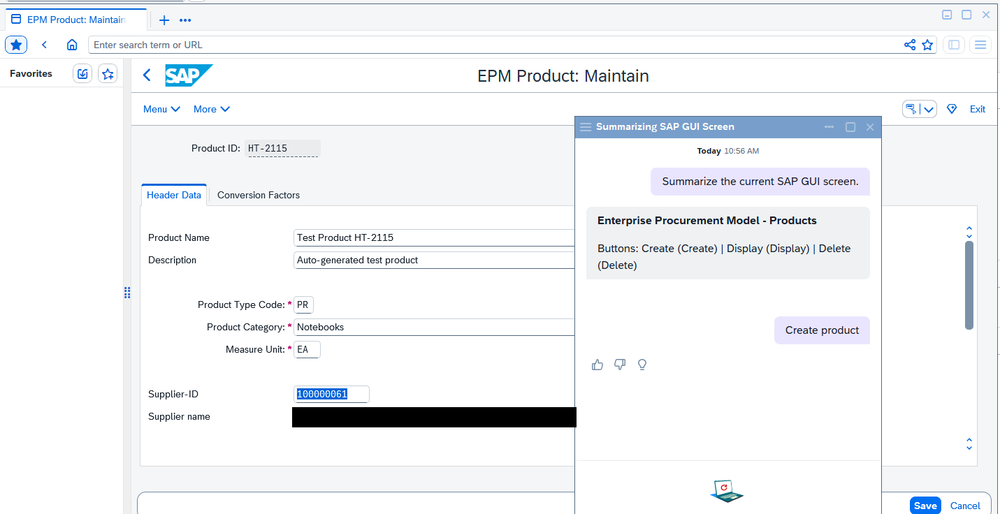
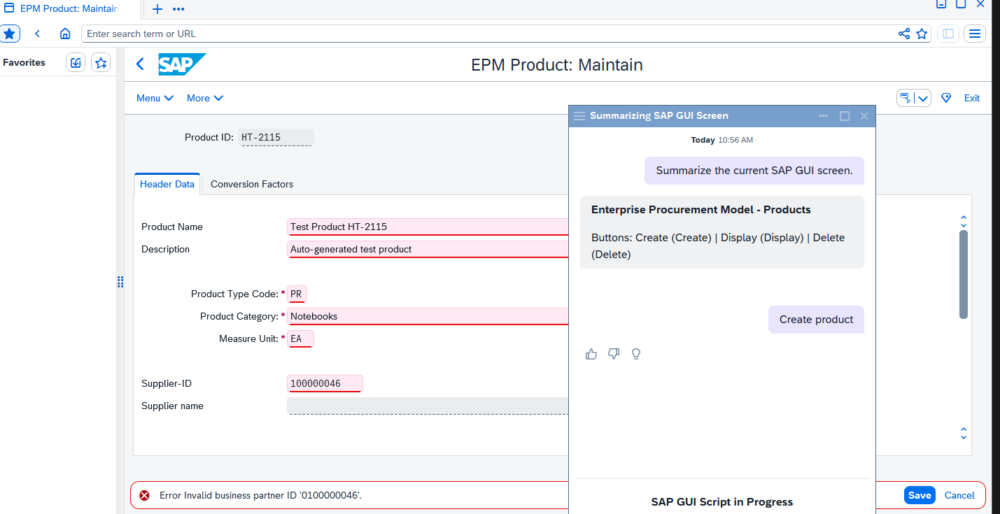
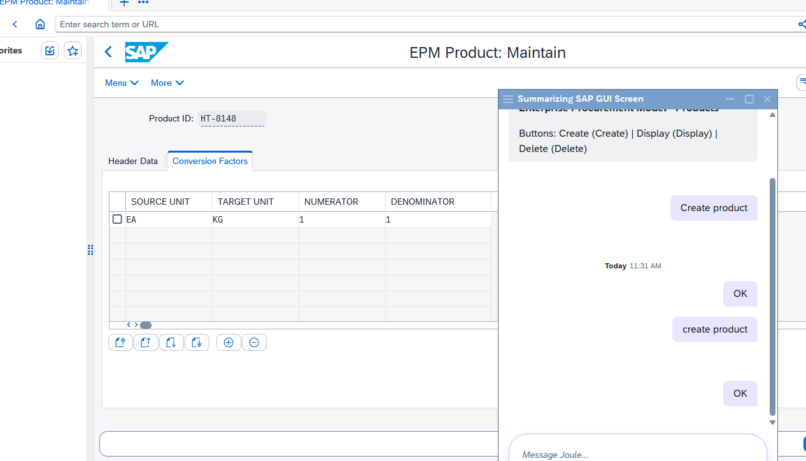

# Joule + SAP GUI: lessons learned from a first end-to-end setup

*Written October 2026 by a Basis consultant (not a developer) who set this sample up on a demo system for the first time. Everything here comes from that one real run. Nothing is taken from a customer system.*

> **Credit.** The capabilities in this repository come from the SAP sample
> [SAP-samples/joule-gui-automation-and-integration](https://github.com/SAP-samples/joule-gui-automation-and-integration)
> (Apache-2.0). This guide only adds notes on how to get them running and what went wrong on the way.

**How to read the labels:** ✅ = I saw it work or fail myself. ⚠️ = my best explanation, not proven.

---

## 1. What this does, in plain words

Joule is SAP's chat assistant. Joule can also *read* and *operate* a classic SAP GUI screen that is open in **SAP Business Client**:

- **"Summarize the current SAP GUI screen"** – Joule reads the screen and explains it in a few lines. Nothing changes in SAP. ✅
- **"Create product"** – Joule fills in the SAP demo transaction `SEPM_PD` step by step and asks you to confirm each step. ✅

The sample ships one hand-written script, for `SEPM_PD` only. A new transaction needs a new script (see section 8).

## 2. The moving parts

```
 You  ──chat──►  Joule (on your Joule tenant, SAP BTP)
                    │  capabilities: "Create product", "Summarize screen"
                    ▼
        SAP Business Client (on your PC)  ◄── NwbcOptions.xml settings
                    │  embedded SAP GUI for Windows
                    ▼
        ABAP demo system  (SAP GUI scripting must be switched on)
```

Two copies of every capability exist: the **source files** (this repo) and the **deployed copy** on your Joule tenant. Editing the source does nothing until you send it to the tenant.

## 3. What you need before you start

| Item | Notes |
|---|---|
| Joule tenant (SAP BTP) | A Joule *service instance* and a role that lets you build and deploy (Extensibility developer for `joule.ext`) |
| Custom-agent consent | Switch on in Joule Admin Center, otherwise the two summary capabilities are **silently skipped** at deploy time |
| SAP Business Client 8.10 + SAP GUI for Windows 8.10 | I used 8.10 patch level 0 |
| Joule Studio CLI | `npm install -g @sap/joule-studio-cli` (Node 20.12 to 24) |
| ABAP demo system | `SEPM_PD` available, **SAP GUI scripting on** (`sapgui/user_scripting = TRUE`, transaction `RZ11`), and **SEPM demo data present** |
| Windows admin rights | To write one file in `C:\ProgramData\SAP\NWBC` |

## 4. Setup, step by step

1. **Install the CLI** and check it: `joule -V`. ✅
2. **Log in yourself:** `joule login`. It asks for five things: authentication URL, client ID, client secret, user name, password. The first three come from a *service key* on your Joule service instance in BTP. Never paste these into chat tools or files. ✅
3. **Check the login:** `joule status`. ✅
4. **Re-namespace** the three capabilities from `com.sap.das.demo` to `joule.ext` (one line in each `capability.sapdas.yaml`). SAP recommends this for customer tenants. ✅
5. **Validate:** `joule lint capabilities`. ✅ (0 errors; warnings about similar scenarios are harmless for a demo.)
6. **Deploy into a new assistant** so existing assistants stay untouched:
   `joule deploy capabilities/da.sapdas.yaml -n <your-assistant-name> -c` ✅
7. **Check:** `joule list` and `joule get <your-assistant-name>`. ✅
8. **Business Client settings file.** Create `C:\ProgramData\SAP\NWBC\NwbcOptions.xml` by copying the template `NwbcOptions.xml.810template` next to it (needs admin rights), then add under `<SingleOptions>`:
   ```xml
   <EnableJouleInSapgui>true</EnableJouleInSapgui>
   <JouleBotName>your-assistant-name</JouleBotName>
   <JouleWebClientUrl>https://<your-joule-tenant-host>/resources/public/webclient/bootstrap.js</JouleWebClientUrl>
   ```
   and under `<EdgeSettings>` change `TrackingPreventionLevel` from `Balanced` to `None`. Restart Business Client fully.
9. **Allow the demo system to embed Joule** (see problem 6 below): add its address to the trusted domains in BTP and in IAS.
10. **Business Client:** create a **Fiori Launchpad** system connection (not "Application Server ABAP"), log on, type `SEPM_PD` in the top bar, click the Joule diamond. ✅



## 5. Problems we hit, and what fixed them

| # | What I saw | Cause | Fix | Status |
|---|---|---|---|---|
| 1 | `joule lint` / `joule list` says *not logged in* | The CLI login had expired between sessions | Run `joule login` again in your own terminal, then `joule status` | ✅ |
| 2 | Joule deploy "succeeds" but the two summary capabilities are missing | Custom-agent consent off in Joule Admin Center | Switch consent on, redeploy | ✅ (documented by SAP) |
| 3 | No Joule button in Business Client | The settings file did not exist, so Business Client never learned about Joule | Create `NwbcOptions.xml` as in step 8 | ✅ |
| 4 | I added `AutoOpenJoule` from a mission page, button still missing | My Business Client build (8.10 PL0) does not know that setting; I could not find it in the program files | Remove it. The three settings in step 8 are the ones the README lists and my build recognises | ⚠️ (cause of the missing button is probable, not proven) |
| 5 | *Security Warning: location is not marked as safe* | Windows Internet Options zone model: the demo system address is not a trusted site | Add the demo system's `https://…` address to **Trusted sites** (Windows + R, `inetcpl.cpl`). Windows security setting, so do it yourself | ✅ |
| 6 | Joule panel opens but is grey with a "blocked" icon, console says *Framing … violates … frame-ancestors* | Joule's web client may only be shown inside websites on an allow-list. My demo system's address was not on it (the list had the same host with a **different port**, two digits swapped, and that port returned "service unavailable") | Add the exact `https://host:port` to **BTP subaccount → Security → Settings → Trusted Domains**, and the host name to **IAS → Tenant Settings → Customization → Trusted Domains** | ✅ for the cause; ⚠️ which of the two lists mattered, I changed both |
| 7 | *404 Not found* on the system entry | I had created the entry as type "Application Server ABAP" with a bare `https://host:port` address | Use **New → New System Connection (Fiori Launchpad)** with the address ending in `/sap/bc/ui2/flp?sap-client=<client>` | ✅ |
| 8 | *Invalid business partner ID '0100000046'* during "Create product" | The sample script hard-codes supplier `100000046`, which does not exist in my demo data | Pick a valid one with **F4** in the Supplier-ID field, put it in the script, update the capability (section 7). If F4 is empty, run `SEPM_DG` to generate demo data first ⚠️ | ✅ (value change), ⚠️ (`SEPM_DG` untested) |
| 9 | `joule update` was not in my notes | I had used `joule deploy` | SAP's mission card recommends `joule update <assistant> --capability-file …` for changing one capability | ✅ |











## 6. Things to watch for

- **You must be logged in to the CLI** for almost everything. Check `joule status` first when something odd happens.
- **Do not put secrets or tenant addresses in any file that can be committed.** The Business Client settings file lives on your PC only.
- **Use a demo system.** "Create product" writes a real record when you press Save.
- **Do not guess where a setting lives.** Two lists with similar names (BTP trusted domains and IAS trusted domains) look alike but do different jobs.
- **Take screenshots with care.** Business Client windows can show other systems' names and user names. Blur or crop before sharing.
- **A successful deploy is not proof that it works.** Always open the assistant in Business Client and run the capability.

## 7. Changing a capability afterwards

Edit the file, then send only that capability to the tenant (run from the `capabilities` folder):

```
joule update <your-assistant-name> --capability-file execute_guided_script/capability.sapdas.yaml
joule list
```

In this repo the supplier ID in `capabilities/execute_guided_script/functions/execute_guided_script.yaml` is set to `100000061`, the value that existed in *my* demo system. Use F4 in your own system and change it to a valid supplier. ✅ The update worked without raising the version number.









## 8. New transactions need new scripts

SAP wrote the "Create product" script by hand. A script is a list of instructions such as "put this text in the field with this ID" and "press that button". The field IDs exist only on one screen, so each new transaction or task needs its own script (10 to 30 lines).

To learn the IDs of a screen, this repo contains a small read-only helper capability, [`tools/list_ui_ids`](../tools/list_ui_ids). Ask Joule to *"Dump the SAP GUI scripting findById paths of the open window."* and it prints a table of the screen's elements. ⚠️ I deployed it but had not yet tested its output when this guide was written.

SAP GUI's scripting interface is not visible to other programs on the PC when the screen is embedded in Business Client (I saw zero connections), so the Joule route is the practical one. ⚠️

## 9. What was verified and what was not

**Verified by me:** the CLI install, login, lint, deploy and update; the Business Client settings; the trusted-site and allow-list fixes; both capabilities running in Business Client; the supplier fix.

**Not verified:** whether the Joule button would have appeared without removing `AutoOpenJoule`; whether `SEPM_DG` fills the demo data; the output of the helper capability; any behaviour on other transactions; any behaviour with a newer Business Client patch level.

## 10. Useful SAP pages

- [Pro-Code Development Tools for Joule](https://help.sap.com/docs/joule/joule-development-guide-ba88d1ec6a1b442098863d577c19b0c0/pro-code-development-tools-for-joule) and its CLI install and `joule login` pages
- [Joule Admin Center](https://help.sap.com/docs/joule/serviceguide/joule-admin-center)
- [Configuring System Connections (SAP Business Client)](https://help.sap.com/docs/SAP_BUSINESS_CLIENT/f526c7c14c074e7b9d18c4fd0c88c593/6f0b63fdc0674ee6b7c08a68acaada0d.html)
- SAP Discovery Center mission *Automate SAP GUI Transactions with Joule Frontend Actions* (sign-in needed)
- The original sample repository linked at the top
